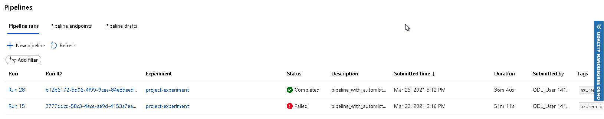

# Udacity-Operationalizing-Machine-Learning

This project is the final process of the second part of Operationalizing Machine Learning with Microsoft Azure ML. In this project we train a model and than expose it to the web with a REST API

## Architectural Diagram

## Key Steps
**Authentication:** we need to enable the Authentication, but because I use the Udacity Lab I'm not able to create assign the role to the user.

**Create an Automated ML Experiment:** we create a dataset from a csv file and then create and run an experiment.

**Deploy the best model:** we choose the best model from the previous experiment and create an endpoint with authentication, to consume this model from the exposed endpoint.

**Enable logging:** we enable logging and Application insights, an Azure Service which provide a loro information about the model.

**Swagger documentation:** we download a docker image of swagger ann run it, after it we download from the model page, the enpoint swagger file that document the service.  

**Consume model endpoint:** we copy the enpint form model page on Azure and put it inside a script used to cpnsume the and point, in this script file we need also to copy the authorization key to consume the endpoint.

**Create publish and consume a Pipeline:** now we can use a Notebook Jupiter to create, public and consume pipeline, with the paramters used in Azure ML Studio.

**Documentation:** the content of this document with all the information discovered.

*Automated ML Experiment*: we create a dataset form the csv storein this [path](https://automlsamplenotebookdata.blob.core.windows.net/automl-sample-notebook-data/bankmarketing_train.csv), then we created an experiment to find the best model.

*Deploy the best model*: we find the best model after the execution of the experiment and deploy it to a REST endpoint, enabling authentication.

*Enable logging*: executing the logs.py file, containg the correct command to enable Application Insight

*Swagger documentation*: we download the swagger.json file of the model deployed, run a swagger container and execute a web server to expose the swagger.json file download before.

*Consume model endpoint*: we consume the rest endpoint with a sample model, and made a benchmark

*Create, publish and consume pipeline*: we used the jupiter notebook provided to create a pipeline tha create a model train it and expose it with an endpoint, a the and it will be tested.

## Screen Recording
[Screencast](https://www.youtube.com/watch?v=PI8D72MV_kA)

## Standout Suggestions
Increasing Exit criteria we can do more accurated iterations.
